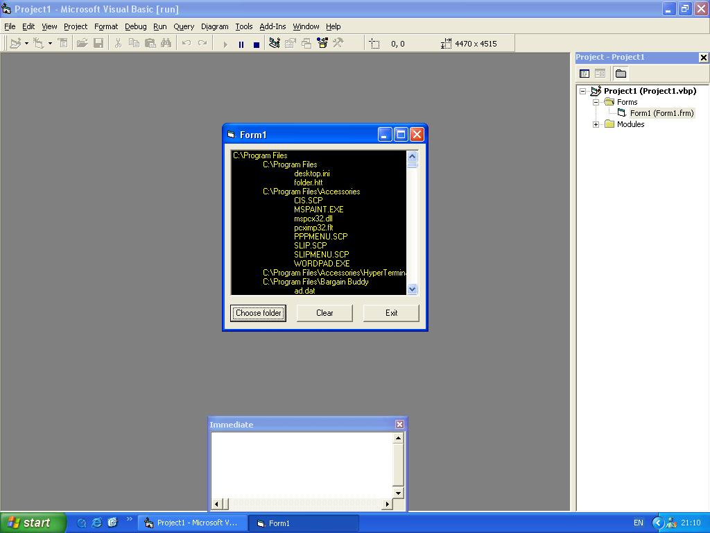



## fso and all subfolders and files

### Description

how to use filesystemobject to get all subfolders and files and how to separate in a listbox, check screen shot.
 
### More Info
 

             |
---                |---
**Submitted On**   |2003-10-02 16:19:02
**By**             |[stephen whittle](https://github.com/Planet-Source-Code/PSCIndex/blob/master/ByAuthor/stephen-whittle.md)
**Level**          |Beginner
**User Rating**    |5.0 (10 globes from 2 users)
**Compatibility**  |VB 6\.0
**Category**       |[Files/ File Controls/ Input/ Output](https://github.com/Planet-Source-Code/PSCIndex/blob/master/ByCategory/files-file-controls-input-output__1-3.md)
**World**          |[Visual Basic](https://github.com/Planet-Source-Code/PSCIndex/blob/master/ByWorld/visual-basic.md)
**Archive File**   |[fso\_and\_al1653141022003\.zip](https://github.com/Planet-Source-Code/stephen-whittle-fso-and-all-subfolders-and-files__1-48960/archive/master.zip)

